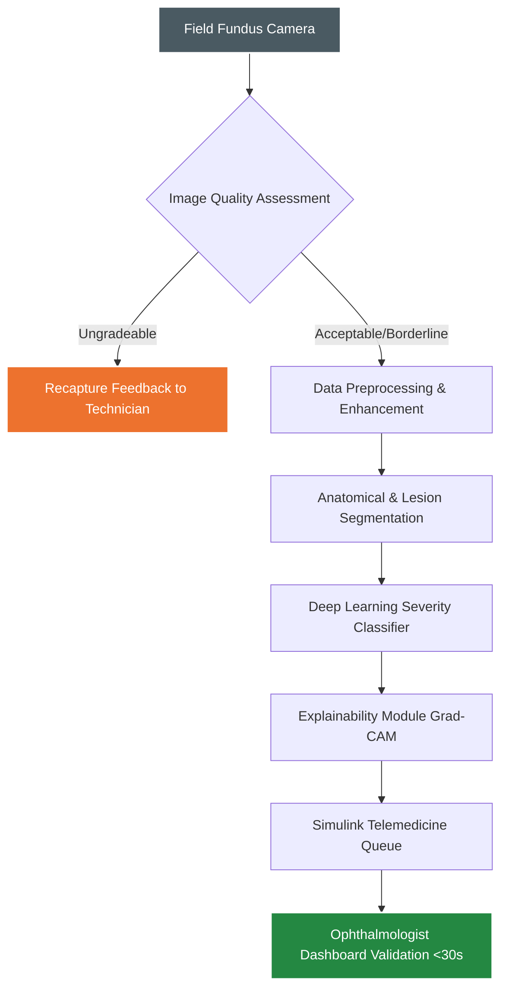
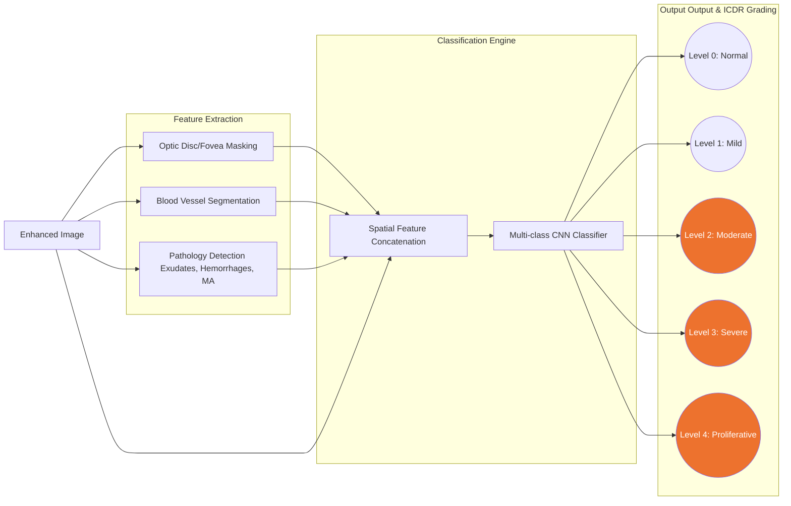

# Explainable AI for Diabetic Retinopathy Screening in Rural India

## 1. Introduction

### The Issue
India currently houses over 77 million diabetic adults, with Diabetic Retinopathy (DR) affecting approximately 18% of this population. While early screening can prevent up to 90% of DR-related vision loss, mass screening in rural India is fundamentally constrained by a severe shortage of specialists (roughly 1 ophthalmologist per 100,000 rural residents). Furthermore, field deployments of portable fundus cameras often yield images of variable quality, which cause existing "black-box" AI models to fail silently or produce unvalidated, untrustworthy results.

### What We Are Solving
We are developing a comprehensive, MATLAB-based retinal image analysis pipeline that automates Diabetic Retinopathy screening. This system is designed specifically for real-world rural deployment, focusing on evaluating image adequacy at the point of care, extracting relevant clinical structures, grading DR severity, and providing clinically meaningful explainability so remote specialists can validate findings in seconds.

### Our Uniqueness
Our solution moves beyond simple classification by integrating a **Human-in-the-Loop workflow**. Key innovations include:
- **Instant Quality Assessment:** Automated rejection of ungradeable images with real-time recapture feedback to the field technician.
- **Sub-Pixel Microaneurysm Detection:** Advanced extraction of minute pathological features.
- **Clinically Grounded Explainability:** Generation of Grad-CAM attention maps and localized lesion evidence, cutting ophthalmologist review time to under 30 seconds.
- **Simulink-Driven Telemedicine Modeling:** A discrete-event simulation that optimizes network bandwidth, edge processing throughput, and specialist review capacity at a district level.

---

## 2. Technical Approach 

The end-to-end technical approach spans from the initial image capture at rural primary health centers to the final diagnostic review by a district ophthalmologist.

### A. Data Preprocessing & Image Quality Assessment (IQA)
- **Quality Check:** An initial lightweight algorithm checks for focus, field of view (FOV), and illumination. 
- **Enhancement:** For borderline images, adaptive techniques like Contrast Limited Adaptive Histogram Equalization (CLAHE) and illumination normalization are applied to correct lighting artifacts without destroying pathological features.

### B. Model Training
- **Data Curation:** Training on diverse fundus datasets with bounding box and pixel-level annotations for various lesions.
- **Architecture:** Utilizing MATLAB's Deep Learning Toolbox to train a Convolutional Neural Network (CNN) backbone (e.g., ResNet50 or EfficientNet) tailored for medical imaging.
- **Optimization:** Class-weighting and data augmentation (rotations, color jittering) are used to handle the class imbalance between mild and severe DR cases.

### C. Post-Training & Explainability
- **Grad-CAM Integration:** Post-training, the model generates Gradient-weighted Class Activation Mapping (Grad-CAM) overlays to highlight the exact regions that influenced the model's prediction.
- **Confidence Calibration:** Output probabilities are calibrated to represent true diagnostic confidence, preventing overconfident misdiagnoses.

### D. Simulink Telemedicine Simulation & Review Distribution
- **Network Simulation:** Using Simulink to model the queuing system of a telemedicine network. 
- **Resource Allocation:** The simulation models varying network bandwidths, edge-device processing times, and doctor availability to dynamically distribute "Referable DR" cases to available specialists, maximizing throughput for 100,000+ patient districts.

---

## 3. Data Classification, Extraction, and Model Working Mechanism

*(Levels 2, 3, and 4 represent "Referable DR" prioritized for specialist review)*

### 1. Feature Extraction (Segmentation)
Before the final classification, the model relies on the MATLAB Computer Vision and Medical Imaging toolboxes to isolate specific regions of interest:
- **Anatomical Landmarks:** Using semantic segmentation (e.g., U-Net architectures) to mask out the Optic Disc and Fovea. This prevents the classifier from confusing the bright optic disc with hard exudates.
- **Vessel Segmentation:** Mapping the retinal vasculature to identify abnormalities like neovascularization.
- **Lesion Detection:** Dedicated algorithms extract microaneurysms (MAs), hard/soft exudates, and hemorrhages. Sub-pixel detection algorithms are crucial here, as MAs are often only a few pixels wide but are the earliest sign of DR.

### 2. Data Classification (Severity Grading)
The problem mandates grading according to the **International Clinical Diabetic Retinopathy (ICDR) severity scale**:
- **Level 0:** No apparent retinopathy.
- **Level 1:** Mild Non-Proliferative DR (Microaneurysms only).
- **Level 2:** Moderate NPDR (More than just MAs, but less than severe).
- **Level 3:** Severe NPDR (Severe hemorrhages, venous beading, IRMA).
- **Level 4:** Proliferative DR (Neovascularization, vitreous/preretinal hemorrhage).

**Referable DR Threshold:** The system groups Levels 2, 3, and 4 as "Referable," requiring >90% sensitivity and >85% specificity.

### 3. Model Working Mechanism
1. **Multi-Modal Input:** The extracted segmentation masks are concatenated with the preprocessed RGB image. 
2. **Feature Learning:** The deep learning model passes this stacked input through successive convolutional layers, extracting hierarchical features (edges in early layers, complex lesion patterns in deeper layers).
3. **Probability Distribution:** The final fully connected layers utilize a Softmax activation function to output a probability distribution across the 5 ICDR classes.
4. **Clinical Evidence Generation:** The explainability module reverse-engineers the decision, mapping the highest-activation nodes back to the original image space to draw bounding boxes and heatmaps directly over the detected exudates and hemorrhages. This generated report is what the remote ophthalmologist reviews.
