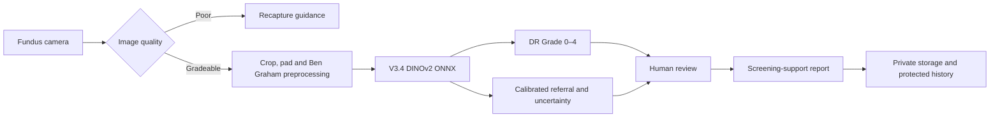

# RetinaSathi

RetinaSathi is a research prototype for diabetic-retinopathy screening support
in rural workflows. It combines a retinal image pipeline, a clinician-review
web application, native MATLAB execution of the frozen model, and an executable
SimEvents model for clinic and district capacity planning.

> RetinaSathi is not a diagnostic system or a clinically approved medical
> device. Every result requires qualified human review.

## Current result

The selected V3.4 candidate uses a partially adapted DINOv2-S/14 encoder with
three outputs: referable DR, ordinal Grade 0–4, and direct five-class grading.
Three seeded fine-tuning runs from the same V3.2 initialization produced the
following source-validation results on the reserved DeepDRiD partition:

| Metric | Three-seed mean | Range |
|---|---:|---:|
| Referable sensitivity | 93.89% | 92.22–95.00% |
| Referable specificity | 90.61% | 89.55–91.36% |
| AUROC | 0.9781 | 0.9756–0.9807 |
| AUPRC | 0.9763 | 0.9745–0.9787 |
| Quadratic weighted kappa | 0.8247 | 0.7910–0.8635 |
| Macro-F1 | 0.5666 | 0.5339–0.6017 |

These are source-validation measurements, not prospective clinical results.
Grade 2 varies most between seeds and Grade 4 recall remains weak. The model is
stronger as a referable-DR screening candidate than as an autonomous five-grade
classifier.

## System architecture



The V3.4 path does not claim DME assessment, lesion localization,
neovascularization detection, or clinically validated attention maps. The
application reports unavailable modules explicitly.

The separate SimEvents model represents operational flow:

```text
arrival → capture queue → camera → quality/recapture → network transfer
        → AI queue → decision routing → routine outcome or clinical review
```

One SimEvents entity is one screening visit. The simulation measures queues,
waiting time, utilization, throughput and bottlenecks; it does not run a new
retinal image through ONNX for every synthetic entity.


## Repository map

| Path | Purpose |
|---|---|
| `src/` | React and TypeScript screening interface |
| `compute/` | FastAPI inference service and runtime tests |
| `ml/` | Data loading, models, training, calibration and evaluation |
| `configs/` | Reproducible V3 experiment configurations |
| `matlab/` | Native preprocessing, ONNX inference, calibration, app and tests |
| `simulink/` | Executable SimEvents workflow, scenarios and verification |
| `migrations/` | Database schema and row-level security migrations |
| `artifacts/` | Small aggregate audits and provenance records |
| `docs/` | Architecture, results, protocols and requirement evidence |

Licensed retinal images, checkpoints, ONNX binaries, local credentials and
generated MATLAB import packages are intentionally excluded from Git.

## Reproduce the software checks

### Web and Python

```bash
cp .env.example .env.local
npm ci
python3.11 -m venv .venv
.venv/bin/python -m pip install -r compute/requirements.txt
./scripts/run_tests.sh
```

Run the local application:

```bash
./scripts/run_full_stack_local.sh
```

V3.4 weights are not stored in this repository. Place the hash-matching ONNX
artifact at `models/retinasathi-v3-4.onnx` before running V3.4 inference. The
expected hash and preprocessing contract are recorded in
`models/retinasathi-v3-4.manifest.json`.

### MATLAB V3.4 parity

With MATLAB R2026a and the required toolboxes:

```bash
./scripts/verify_v3_4_matlab.sh
```

Verified local result:

```text
PASS: 8 MATLAB tests, 25 parity cases, grade 1.000, referral 1.000
```

The parity cohort checks implementation consistency between Python, ONNX and
MATLAB. It is not an independent accuracy evaluation.

### SimEvents workflow

```matlab
cd('simulink')
report = verify_simevents_workflow(true, "results/simevents");
```

Verified result:

```text
PASS: 14/14 SimEvents software checks.
```

The configured district scenario completed 508 visits in a ten-hour simulated
day, equivalent to 127,000 screenings across 250 identical operating days. This
is a planning estimate based on declared assumptions, not observed clinical
throughput.


## Evidence index

- [Complete project explanation](docs/COMPLETE_PROJECT_EXPLANATION.md)
- [Final SIH remediation report](docs/SIH_FINAL_REMEDIATION_REPORT.md)
- [Demo runbook](DEMO.md)
- [Architecture](docs/ARCHITECTURE.md)
- [Model selection rationale](docs/MODEL_SELECTION_AND_APPROACH_REPORT.md)
- [V3.4 results](docs/V3_4_RESULTS.md)
- [Three-seed stability](docs/V3_4_THREE_SEED_STABILITY.md)
- [Data card](docs/V3_DATA_CARD.md)
- [MATLAB parity report](docs/V3_4_MATLAB_PARITY_REPORT.md)
- [SimEvents results](docs/SIMULATION_RESULTS.md)
- [SIH, MATLAB and Simulink audit](docs/SIH_MATLAB_SIMULINK_FULL_AUDIT.md)
- [Clinical pilot plan](docs/V3_4_CLINICAL_PILOT_AND_APP_INTEGRATION.md)

## Current limitations

Before clinical use, the frozen candidate still requires an independent,
prospective, multi-site evaluation using representative Indian cameras and
ophthalmologist reference grades. It also requires subgroup analysis,
deployment load testing, clinician-rated report usability, and validated
lesion/DME/neovascularization modules if those outputs are added.

The current web application routes authenticated screening requests through an
InsForge server function to a protected Azure Container Apps deployment of the
84.27 MiB V3.4 ONNX model. Azure is configured with zero minimum and one maximum
replica, so the first request after idle time can be slower. Runtime identity is
returned with every prediction and must agree with the model card before a demo.

## Deployment

```text
Browser → InsForge Auth → authenticated server function
        → Azure Container Apps → V3.4 ONNX Runtime
```

- Website: <https://69exmaqk.insforge.site/>
- Model: `classifier-v3.4-seed26038`
- Architecture: partial DINOv2 ViT-S/14
- Input: 392 × 392 RGB after crop, square padding and Ben Graham enhancement
- Referral threshold: `0.2073261738`
- Explainability: disabled for V3.4 until a technically and clinically validated method exists
- DME, lesion, vessel, optic-disc and fovea outputs: unavailable in the deployed V3.4 path

The live site and cloud state can change independently of this repository. Use
`docs/AZURE_DEPLOYMENT_VERIFICATION.md` and the `/health` and `/model-card`
responses to verify the active release before presenting it.
