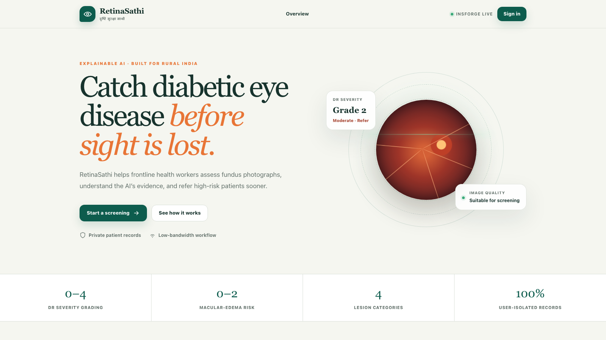
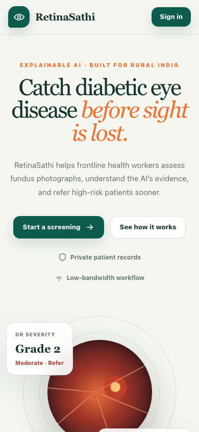
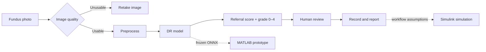

# RetinaSathi

### Retinal screening support, from image capture to human review

RetinaSathi is a Smart India Hackathon 26038 research prototype. A health worker uploads a photograph of the back of the eye (a *fundus image*). The system checks image quality, estimates diabetic retinopathy (DR) referral risk and severity, and sends the result for human review. A separate Simulink model explores how the workflow behaves at clinic and district scale.

**Start here:** [See the prototype](#see-the-prototype) · [Understand the workflow](#how-it-works) · [Run it locally](#run-the-project) · [Explore the folders](#repository-map) · [Read the documentation](docs/README.md)

> **Research use only.** This is a screening-support prototype, not a diagnosis or medical device. An ophthalmologist makes the clinical decision. Prospective Indian clinical validation is still needed.

## See the prototype

| Web application | MATLAB image-analysis prototype |
|:---:|:---:|
|  |  |
| Actual browser capture of the public app landing page. Its sample Grade 2 card is illustrative UI content. | Actual V3.4 MATLAB prototype screenshot supplied by the project owner. The coloured regions are experimental lesion candidates requiring clinician confirmation. |

| Simulink clinic workflow | SimEvents results |
|:---:|:---:|
|  |  |
| Executable queue and resource model. Each entity represents a screening visit. | Simulated engineering outcomes, not observed patient throughput. |

<details>
<summary>View the mobile web app capture</summary>



</details>

**[Public web demo](https://69exmaqk.insforge.site):** The [24 September deployment verification](docs/AZURE_DEPLOYMENT_VERIFICATION.md) recorded a protected **V3.4 ONNX** runtime behind an authenticated InsForge function and Azure Container Apps. The screenshot shows the interface, not a clinical validation result. The local V3.4 path below allows independent engineering checks.

## How it works



**In plain language:** “referable” means the image should be reviewed by an eye specialist. Grade 0–4 is estimated DR severity. A poor image receives **no** grade or referral decision; the operator is asked to retake it. V3.4 does **not** provide validated DME assessment or a validated patient-specific explanation map.

The web app uses React and TypeScript. InsForge provides authentication, private image storage, and owner-scoped records. FastAPI runs model inference; cloud screening passes through an authenticated InsForge function to a protected Azure Container App. MATLAB independently implements retinal preprocessing and imports the frozen ONNX model. Simulink/SimEvents models queues, cameras, network delays, and reviewer capacity; it does not classify each simulated patient's image.

## What has been built

| Area | Current state | Evidence and detail |
|---|---|---|
| Web app | Sign-in, upload, quality feedback, DR results, history, human review, and printable report | [Architecture](docs/ARCHITECTURE.md) · [Deployment verification](docs/AZURE_DEPLOYMENT_VERIFICATION.md) |
| DR model | V3.4 partially adapted DINOv2-S/14 with separate referral and severity outputs; verified cloud runtime and local research path | [V3.4 results](docs/V3_4_RESULTS.md) · [Deployment verification](docs/AZURE_DEPLOYMENT_VERIFICATION.md) |
| Training | Data manifest, patient-aware development splits, versioned configs, training and evaluation scripts, three-seed stability study | [Training guide](docs/MODEL_TRAINING_GUIDE.md) · [Stability results](docs/V3_4_THREE_SEED_STABILITY.md) |
| Lesion segmentation | Four-class V3.2 **experimental** mask candidate for microaneurysms, haemorrhages, hard exudates, and soft exudates; internal 11-image full-image mean Dice **0.3937**. Border and optic-disc false positives remain; clinician confirmation is required. | [Lesion implementation and limitations](docs/LESION_SEGMENTATION_V3_IMPLEMENTATION.md) |
| Other image modules | Learned quality, vessel segmentation, disc/fovea localization, and earlier V2 attention experiments have separate evidence and availability gates. They are not validated V3.4 clinical outputs. | [Complete explanation](docs/COMPLETE_PROJECT_EXPLANATION.md) |
| MATLAB | Native V3.4 preprocessing, ONNX inference, calibration, app, and report; grade and referral agreed on **25/25 engineering parity cases** | [MATLAB guide](matlab/README.md) · [Parity report](docs/V3_4_MATLAB_PARITY_REPORT.md) |
| Simulink | Executable SimEvents workflow and seven scenario runs | [Simulink guide](simulink/README.md) · [Simulation results](docs/SIMULATION_RESULTS.md) |
| Clinical readiness | Human review required; prospective Indian validation pending | [Pilot plan](docs/V3_4_CLINICAL_PILOT_AND_APP_INTEGRATION.md) |

On a 400-image, patient-separated **DeepDRiD source-validation** set, selected V3.4 seed 26038 recorded **92.22% referable sensitivity** and **91.36% specificity**. This is retrospective research evidence, not an untouched prospective clinical test. Exact five-grade classification is weaker, especially for rare grades. Earlier V2 results and the model-selection path are explained in the [selection report](docs/MODEL_SELECTION_AND_APPROACH_REPORT.md).

## Run the project

### 1. Explore the web interface

Prerequisites: Node.js and npm. Sign-in and saved records require InsForge browser configuration for your project in `.env.local`; the repository does not include credentials.

```bash
git clone https://github.com/1conicYaz/X-Retina.git
cd X-Retina
cp .env.example .env.local
npm ci
npm run dev
```

Open the URL printed by Vite. You can explore the landing page without training a model. Authenticated screening requires the configured backend.

### 2. Run local V3.4 screening

Prerequisites: Python 3.11, the requirements below, and the **hash-matching V3.4 checkpoint and validation report**. Checkpoints and medical images are intentionally excluded from Git. Obtain them through the team's approved handoff. The [integration guide](docs/V3_4_CLINICAL_PILOT_AND_APP_INTEGRATION.md#which-checkpoint-is-loaded-in-the-application) records the expected artifact paths.

```bash
python3.11 -m venv .venv
.venv/bin/python -m pip install -r compute/requirements.txt
./scripts/run_v3_4_local.sh
```

The launcher starts FastAPI at `127.0.0.1:8000` and Vite at the printed local address. Visit `/health` and `/model-card` on the API to see what loaded. The service rejects a checkpoint that does not match its validation record.

### 3. Run MATLAB and Simulink

Follow the [step-by-step MATLAB and Simulink user guide](docs/MATLAB_SIMULINK_USER_GUIDE.md) for software requirements, model-file placement, window controls, example commands, scenario runs, and troubleshooting. The engineering parity gate is `./scripts/verify_v3_4_matlab.sh`; it also requires local parity fixtures. MATLAB operates on actual images; SimEvents operates on simulated visits.

### 4. Reproduce model research

Raw datasets, licensed images, checkpoints, and full training runs are **not** in this GitHub repository. Start with the [training guide](docs/MODEL_TRAINING_GUIDE.md), [data card](docs/V3_DATA_CARD.md), [dataset inventory](docs/DATASET_INVENTORY.md), and [V3.4 experiment record](docs/V3_4_RESULTS.md). With authorized local datasets and `RETINASATHI_DATA_ROOT` set, these are the entry points:

```text
scripts/build_v3_data_manifest.py   → validate sources, labels, hashes, and splits
configs/classifier_v3_4.yaml        → V3.4 training configuration
scripts/train_classifier_v3_4.sh    → PyTorch training
scripts/audit_v3_candidate.py       → candidate evaluation and gates
scripts/export_v3_4_onnx.py         → frozen inference artifact
scripts/verify_v3_4_matlab.sh       → Python/ONNX/MATLAB parity
```

Read the [training guide](docs/MODEL_TRAINING_GUIDE.md) before a new run. Keep the official test partition out of model selection. Lesion training has its own [implementation notes](docs/LESION_SEGMENTATION_V3_IMPLEMENTATION.md); a segmentation mask is different from a model-attention map.

## Repository map

| Folder | What a new reader will find |
|---|---|
| [`src/`](src/) and [`public/`](public/) | Web interface and static assets |
| [`functions/`](functions/) | Authenticated cloud inference proxy |
| [`compute/`](compute/) | FastAPI inference service, model runtimes, and API tests |
| [`ml/`](ml/) and [`configs/`](configs/) | Data processing, models, training, evaluation, and experiment settings |
| [`models/`](models/) | Small model manifests; large binaries stay outside Git |
| [`matlab/`](matlab/) | Image-analysis app, V3.4 inference, and tests |
| [`simulink/`](simulink/) | SimEvents builder, scenarios, and result summaries |
| [`scripts/`](scripts/) | Launchers, audits, export, and verification commands |
| [`docs/`](docs/) | [Guided documentation index](docs/README.md), evidence, and historical notes |
| [`migrations/`](migrations/) | Database schema and access-control migrations |
| [`artifacts/`](artifacts/) | Small versioned audit summaries; generated or sensitive output is ignored |

The folders follow **parts of the system**. For an end-to-end tour, use the [plain-language project explanation](docs/COMPLETE_PROJECT_EXPLANATION.md). Historical reports remain for provenance; the V3.4 links above describe the current local candidate.

## Verify and contribute

```bash
./scripts/run_tests.sh
```

This runs lint, TypeScript checks, the web build, and Python unit tests after the Python environment is prepared. MATLAB and Simulink have separate verification commands in their READMEs. Never commit `.env.local`, patient images, raw medical datasets, or model checkpoints. Tie every model-performance statement to a reproducible report and name the evaluated split.
