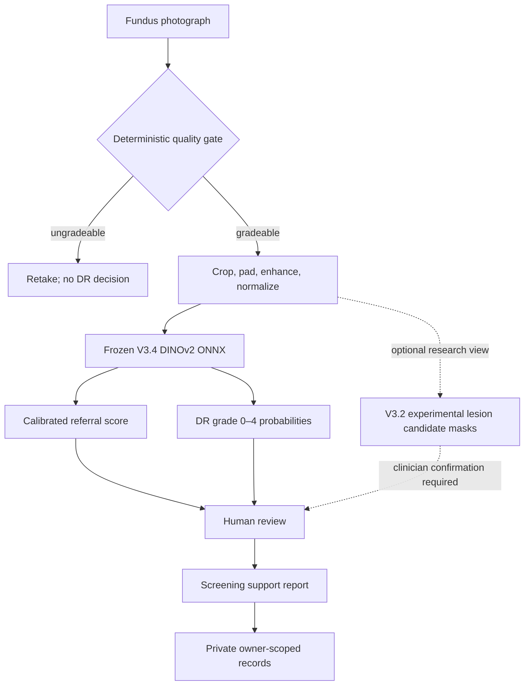
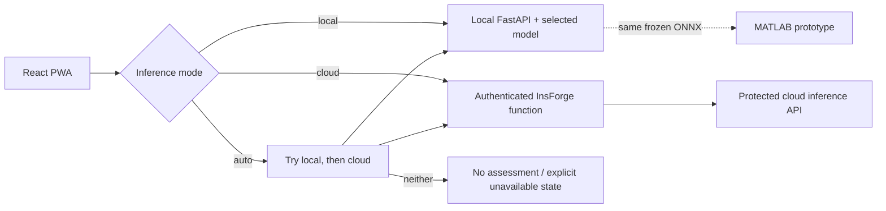
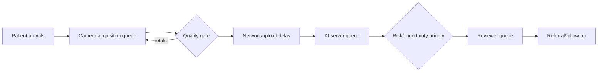

# RetinaSathi architecture

RetinaSathi combines a React web application, a Python inference service, private InsForge records, a MATLAB image-analysis prototype, and a SimEvents clinic simulation. Read this diagram as the **local V3.4 candidate** path. The public V1 backup and older V2 research modules have separate model contracts.

## Runtime modes

## District workflow

## Version policy

- `V1`: preserved 224×224 MobileNetV3 multi-task baseline and lightweight public backup.
- `V2`: locked EfficientNet-B3 research artifact with an official-test result and a documented Messidor domain-shift failure. Its Grad-CAM, vessel, and localization outputs are version-specific research features.
- `V3.4`: local frozen DINOv2 candidate with a dedicated referral head and grade outputs. DME is **not assessed**. Its unvalidated attention map remains disabled.
- `V3.2 lesion segmentation`: separate optional four-class candidate overlay. It has real pixel-level training and measured internal Dice, but visible false positives prevent a validated lesion claim.
- Model binaries and medical datasets stay outside Git. Small manifests define hashes, preprocessing, calibration, and status; unavailable modules must say so explicitly.
