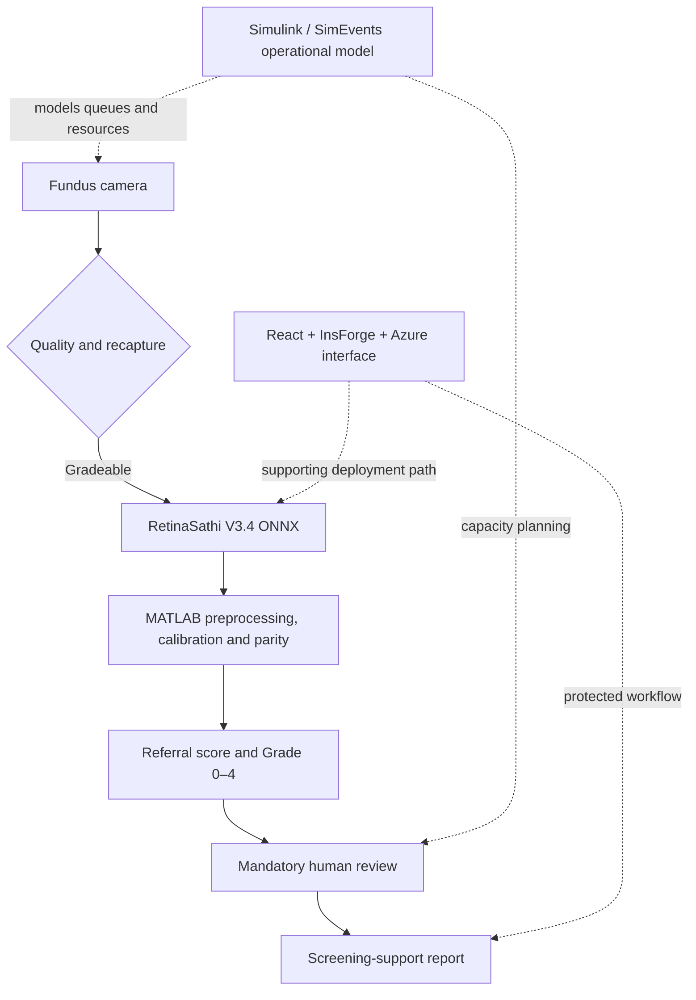
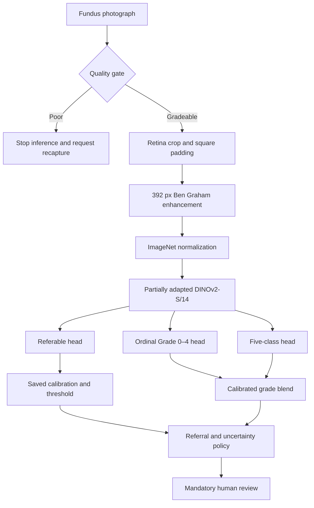
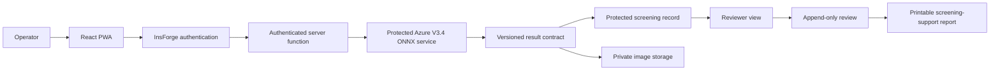
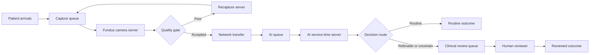

# RetinaSathi architecture

RetinaSathi separates MATLAB-compatible image inference, SimEvents operational
simulation and the supporting web deployment. This keeps model evidence,
capacity estimates and product behavior distinct.

## System view

The diagram contains two related paths. Solid arrows show one-image screening.
Dotted arrows show simulation or deployment support; SimEvents does not execute
the image model for each synthetic visit.

## Retinal inference

V3.4 returns a five-grade probability distribution and a separately calibrated
referable probability. DME is not assessed. Lesion, vessel, optic-disc and
fovea research experiments are not presented as V3.4 clinical outputs.

The selected seed-26038 model is exported to a fixed ONNX graph. MATLAB verifies
the ONNX SHA-256 recorded in the manifest, reproduces the preprocessing and
calibration policy, and matched 25/25 Python reference decisions in the parity
cohort.

## Supporting application and storage

Authentication, private storage and owner-scoped database policies are handled
through InsForge. The client stores a pseudonymous patient reference rather
than a patient name. A local FastAPI runtime is available for development and
demo fallback. The optional seven-day browser retry queue requires stronger
device security and recovery testing before any pilot.

## SimEvents operational model

One entity represents one screening visit. The workflow uses configured arrival
rates, service times, capacities, image size, bandwidth and routing rates. The
AI server represents measured/configured station time; it does not execute ONNX
for each synthetic visit.

The seven scenarios test baseline operation, constrained bandwidth, increased
load, an additional camera, an additional reviewer, priority review and a
district configuration. The automatic verifier checks accounting, utilization,
network behaviour, resource sensitivity and annual-equivalent capacity.

## Safety boundaries

- Poor-quality images do not receive a DR prediction.
- Every output requires human review.
- Attention is model influence, not a lesion map.
- Missing modules are reported as unavailable or not assessed.
- Simulation figures are planning estimates, not hospital observations.
- Source validation and software parity do not establish clinical readiness.
