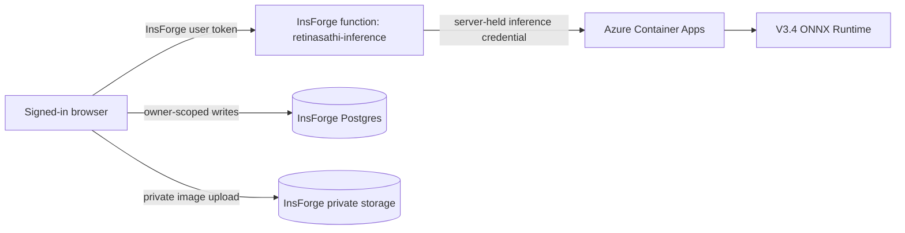

# Azure and InsForge deployment verification

Verification date: 23 September 2026. Secret values are intentionally omitted.

## Architecture

## Freshly verified cloud state

| Property | Evidence observed | Status |
|---|---|---|
| Website | `https://69exmaqk.insforge.site/` loaded and described Azure V3.4 | Pass |
| InsForge function | `retinasathi-inference`, active | Pass |
| Function authentication | Requires bearer token and calls `auth.getCurrentUser()` | Pass |
| Azure app | `retinasathi-v34`, resource group `retinasathi-azure`, UAE North | Pass |
| Revision | `retinasathi-v34--latest`, active, healthy, 100% traffic | Pass |
| Container | `retinasathiv34uae.azurecr.io/retinasathi-v34:3` | Pass |
| Runtime model | `classifier-v3.4-seed26038` | Pass |
| Architecture | Partial DINOv2 ViT-S/14, ONNX CPU | Supported by manifest; runtime identity enhancement pending deployment |
| Referral threshold | `0.20732617378234863` | Pass |
| Ingress | External HTTPS; insecure HTTP disabled | Pass |
| Prediction authentication | Azure checks `X-Inference-Key`; secret is held by InsForge function | Pass |
| CORS | Production site and local development origins only | Pass |
| Scale | minimum 0, maximum 1, HTTP trigger at 10 concurrent requests | Pass |
| Resources | 1 vCPU, 2 GiB memory | Pass |
| Health probes | No explicit Container Apps probes configured | Partial |
| Model artifact SHA in live health | Not returned by current revision | Partial; fixed in release branch |
| Build commit and deployment revision in live prediction | Not returned by current revision | Partial; fixed in release branch |
| Warm/cold latency | Not measured during this verification | Not run |

## Security properties

| Property | Result | Evidence and limit |
|---|---|---|
| Azure key absent from browser bundle | Pass | Browser calls the InsForge function; deployed function reads the key from server environment |
| Direct anonymous prediction blocked | Pass | Authenticated file request without key is expected to receive 401; malformed request alone receives FastAPI 422 before route authentication |
| Private retinal storage | Pass | Live bucket is private; owner policies exist in migrations; fresh storage-policy SQL should be retained with release evidence |
| Owner-scoped screening rows | Pass | Live `screenings`, `screening_reviews` and `screening_lesions` policies were listed and are owner scoped |
| Secret values excluded from Git | Pass subject to final secret scan | `.env*` and `.insforge/project.json` are ignored |
| Rate limiting | Partial | Azure allows one replica and the app limits inference concurrency; no per-user quota is implemented |
| Request bounds | Release fix | 15 MiB encoded limit plus decoded pixel/dimension limits and timeout |
| Error leakage | Pass in inspected paths | Proxy returns structured generic errors; no upstream secrets are returned |

## Scale-to-zero behavior

`minReplicas=0` reduces idle cost. When the service has scaled to zero, the first screening must start the container and load the 84.27 MiB model. That request can be much slower than a warm request. The UI should say “starting cloud model” on 502/503/504 retries. Warm local CPU timing must not be presented as complete cloud latency.

## Deployment gate

Before an SIH demonstration, verify all of the following against the same release:

1. `/health` returns V3.4, the expected model SHA, build commit and Azure revision.
2. `/model-card` returns the same identity and threshold.
3. An authenticated prediction returns the same identity.
4. A request without the Azure inference key is rejected.
5. A poor image returns `retake_required` and no referral decision.
6. The website saves and reloads the same state from History.

The final authenticated upload/save/history test is not complete until a permitted public fixture is submitted through the signed-in website after the new release is deployed.
