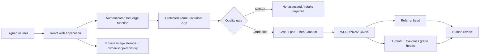

# RetinaSathi: complete project explanation

This guide explains RetinaSathi from the original problem to the current V3.4 prototype. It is written for teammates, interviewers, judges, recruiters, friends and family. Technical terms are explained when they first appear.

> RetinaSathi is a research screening-support prototype. It is not a diagnosis, a clinically approved medical device or a replacement for an ophthalmologist.

## 1. The problem in simple words

Diabetic retinopathy (DR) is damage to the retina associated with diabetes. A retinal photograph can contain signs that require specialist attention, but screening capacity and specialists may be limited. RetinaSathi explores whether software can help check image quality, estimate whether a case should be referred and organize human review.

The safe goal is **triage support**: help decide which photographs need prompt professional review. The software never makes the final clinical decision.

## 2. What works today

The current prototype can:

1. accept JPEG, PNG or WebP fundus images;
2. reject known poor, malformed or oversized inputs;
3. preprocess a gradeable image using crop, square padding and Ben Graham enhancement;
4. run the frozen V3.4 ONNX model;
5. return a dedicated referable-DR score and threshold;
6. estimate ICDR grade 0–4 and show all five probabilities;
7. route uncertain, rejected, referable and non-referable results separately;
8. require human review for every result;
9. save an authenticated user's image and result history through InsForge;
10. run the same frozen artifact in MATLAB;
11. simulate queues, cameras, network delays and reviewer capacity in SimEvents.

V3.4 does **not** currently provide validated DME, lesion, vessel, optic-disc, fovea or explanation maps. Those modules are displayed as unavailable. The earlier V3.4 explanation map failed technical validation, so it is deliberately disabled.

## 3. End-to-end architecture



The browser does not contain the Azure inference secret. A signed-in user calls an InsForge server function; that function checks the user and then calls Azure with a server-side key.

## 4. The V3.4 model

V3.4 uses a partially adapted **DINOv2 ViT-S/14** encoder. DINOv2 learned general visual features before our DR training. We selected it after comparing the project’s earlier MobileNet/EfficientNet baselines and foundation-model experiments under a common evaluation approach.

The network has three outputs:

- **Binary referral head:** estimates whether the image is referable DR.
- **Ordinal head:** learns that grades have an order from 0 to 4.
- **Nominal five-class head:** estimates a probability for each grade.

The grade result combines ordinal and nominal probabilities. Referral comes from the dedicated binary head. It must not be replaced with `P(grade 2) + P(grade 3) + P(grade 4)` because the two calculations can disagree.

Current frozen identity:

| Item | Value |
|---|---|
| Model | `classifier-v3.4-seed26038` |
| Architecture | partial DINOv2 ViT-S/14 |
| Input | 392 × 392 RGB |
| ONNX size | about 84.27 MiB |
| ONNX SHA256 | `8d5373211b8651e1a3c787a19bfd52a64383d8a2296f370cbf2615467422b2ec` |
| Referral threshold | `0.20732617378234863` |
| Calibration | binary, ordinal and nominal temperature scaling recorded in the manifest |
| XAI | disabled; not technically verified |

The threshold is below 0.5 because it was selected for the screening objective. A probability threshold is an operating choice, not a universal definition of disease.

## 5. What the reported metrics mean

On the selected 400-image, patient-separated DeepDRiD source holdout, historical evaluation recorded:

| Metric | Result | Meaning |
|---|---:|---|
| Sensitivity | 92.22% | 166 of 180 referable cases were flagged |
| Specificity | 91.36% | 201 of 220 non-referable cases were correctly kept below referral |
| AUROC | 0.9756 | Ranking performance across thresholds |
| AUPRC | 0.9745 | Precision-recall ranking performance |
| QWK | 0.7910 | Ordered agreement for grades 0–4 |
| Macro-F1 | 0.5339 | Average class-wise five-grade F1 |

These are retrospective source-validation results. DeepDRiD also contributed development data, so this is not an untouched independent clinical test. Exact five-grade classification is weaker than binary referral, especially for rare grades. The model is therefore presented as a referral-screening candidate with grade support and mandatory review.

## 6. Training journey

The project progressed in controlled stages:

- **V1:** lightweight MobileNetV3 engineering baseline.
- **V2/V3 experiments:** better data manifests, patient-aware splits, calibration, class-imbalance handling and EfficientNet-style baselines.
- **V3.1–V3.3:** compared stronger representations including DINOv2 and RETFound-related experiments.
- **V3.4:** selected partial DINOv2 adaptation with separate referral, ordinal and nominal heads; repeated fine-tuning with seeds 26038, 26039 and 26040 from the same V3.2 initialization.

The three seeds test fine-tuning stability. They are not three completely independent model initializations. Knowledge distillation was discussed as future optimization but was not used to train V3.4.

## 7. Data approach

The repository records data provenance without committing licensed images. Patient-level grouping is used wherever identifiers permit so photographs from one patient do not leak across training and validation partitions. Class imbalance is handled in training and evaluated with sensitivity, specificity, QWK, macro-F1 and per-class confusion results instead of accuracy alone.

Datasets used or investigated include EyePACS, APTOS, IDRiD and DeepDRiD. Their licenses, label systems and permitted uses differ. The checked-in data card and manifests are the source of truth for each experiment. Retinal datasets and patient images must stay outside Git.

## 8. Image processing and prediction

For a gradeable image, the runtime:

1. decodes the file and checks type, byte size, dimensions and total pixels;
2. checks brightness, contrast, sharpness and fundus-field geometry;
3. crops the retinal field and removes black border where possible;
4. pads to a square without stretching anatomy;
5. applies Ben Graham enhancement;
6. resizes to 392 × 392 and normalizes RGB channels;
7. runs ONNX inference;
8. temperature-calibrates the model outputs;
9. compares the dedicated referral score with the manifest threshold;
10. returns an explicit assessment state and model provenance.

If quality fails, grade and referral are `null`. The result becomes `retake_required`, and History must never display it as Routine.

## 9. Result states

| State | Meaning | UI action |
|---|---|---|
| `assessed_referable` | Dedicated referral score crossed the threshold | Refer for qualified examination |
| `assessed_non_referable` | Valid assessment below the referral threshold | Routine pathway with human review |
| `uncertain` | Model confidence is insufficient for normal routing | Manual review |
| `retake_required` | Image quality prevents assessment | Capture another image |
| `not_assessed` | Processing could not produce a valid assessment | Do not make a clinical-looking decision |

## 10. Security and privacy

- Sign-in is required for screening and history.
- Database rows use owner-based row-level security.
- Retinal images are stored in a private bucket.
- Azure's prediction endpoint requires a server-held inference key.
- Browser JavaScript receives no Azure secret.
- Production CORS is restricted to the application origin.
- HTTPS is used for the deployed path.
- The API limits encoded bytes, decoded dimensions and total pixels.
- Runtime responses include model/config hashes and deployment identity.

The offline queue stores pending data in browser IndexedDB for up to seven days. It is useful for interrupted connectivity but is not encrypted independently by the app; managed-device policy or stronger encryption is future work.

## 11. MATLAB

MATLAB imports the same frozen ONNX artifact and reproduces preprocessing, calibration and decision logic. Fresh verification on 23 September 2026 passed 8 MATLAB tests and all 25 parity fixtures with 100% grade and referral agreement.

This proves implementation consistency. It does not prove clinical accuracy on a new population.

Run it from macOS Terminal:

```bash
cd /path/to/X-Retina
./scripts/verify_v3_4_matlab.sh
```

Or from the MATLAB Command Window:

```matlab
cd('/path/to/X-Retina/matlab')
setup
status = check_toolboxes();
disp(status)
result = runRetinaPipelineV34('../runs/demo_cases/referable.jpg');
disp(result)
```

## 12. Simulink and SimEvents

Simulink is an executable block-diagram environment. SimEvents adds queues, entities and service events. The RetinaSathi model is more than an ER diagram: entities move through camera capture, quality/recapture, network transfer, AI inference and human review while simulated time advances.

One entity represents one screening visit. The model does not run the ONNX model for every synthetic entity; it studies operations and capacity. Fresh verification passed all 14 checks and seven scenarios. The district scenario's 127,000 annual-equivalent value is a calculation from 508 simulated completions per ten-hour day × 250 identical days, not real patient throughput.

```matlab
cd('/path/to/X-Retina/simulink')
report = verify_simevents_workflow(true, "results/simevents");
```

The **Queue Scope** graph shows queue occupancy over simulated time. A value of 0 means no one is waiting; 1 means one entity is waiting. The vertical transitions are arrivals and departures. Use the dashboard and verification table for interpretation rather than expecting a retinal image animation.

## 13. Local development commands

```bash
git clone https://github.com/1conicYaz/X-Retina.git
cd X-Retina
cp .env.example .env.local
npm ci
python3.11 -m venv .venv
.venv/bin/python -m pip install -r compute/requirements.txt
./scripts/run_tests.sh
./scripts/run_full_stack_local.sh
```

The ONNX binary is intentionally excluded from Git. Place the hash-matching file at `models/retinasathi-v3-4.onnx` before starting the V3.4 service:

```bash
./scripts/run_v3_4_local.sh
```

Useful checks:

```bash
npm test
npm run lint
npm run typecheck
npm run build
curl http://127.0.0.1:8000/health
curl http://127.0.0.1:8000/model-card
```

## 14. How to explain it in an interview

Use this short answer:

> RetinaSathi is a human-in-the-loop diabetic-retinopathy screening-support prototype. We use a partially adapted DINOv2 ViT-S/14 model with a dedicated referral head and ordinal plus nominal grade heads. The deployed application authenticates through InsForge and calls a protected V3.4 ONNX service on Azure Container Apps. We hardened unsafe states so an ungradeable image cannot become a normal result, persist the real referral score and threshold, and disabled V3.4 XAI because its earlier map failed validation. MATLAB proves cross-runtime parity, while SimEvents studies clinic queues and capacity. Our best current evidence is retrospective source validation, so independent intended-camera and prospective clinical evaluation remain future work.

## 15. Questions you should be ready for

- Why use DINOv2? It offers strong transferable visual representations while remaining small enough for practical deployment.
- Why three heads? Referral and exact grade are related but different objectives; ordinal structure helps grading while a dedicated binary head supports the screening decision.
- Is 92.22% accuracy? No. It is sensitivity on the selected retrospective holdout.
- Why is the threshold 0.2073? It is the frozen calibrated operating threshold selected for the screening objective, not a default 0.5 rule.
- Does the heatmap locate lesions? No. V3.4 XAI is disabled because the previous map failed technical validation.
- Is it ready for hospitals? No. It is demo-ready research software; independent and prospective validation, governance and regulatory work remain.
- What happens without internet? A local runtime can be used for demonstration; pending saves can queue in the browser, with stated privacy limits.
- What does MATLAB add? Reproducible image-processing and ONNX parity evidence in the problem sponsor's ecosystem.
- What does SimEvents add? Evidence-based capacity planning for cameras, network and reviewers.

## 16. Current limitations

1. No independent intended-camera Indian clinical cohort.
2. Exact five-grade performance is weaker than referral performance.
3. Quality/OOD handling is heuristic and does not recognize every possible non-retinal input.
4. V3.4 XAI and lesion localization are unavailable.
5. DME cannot be confirmed from this classifier; OCT or clinical examination may be needed.
6. Reviewer roles and audit governance are prototype-level.
7. Azure scale-to-zero can cause a slower first request after idle time.
8. The offline queue needs stronger device security and recovery testing before a pilot.

## 17. Best next steps after SIH

1. **Independent intended-camera validation:** freeze model and threshold, collect an ethically governed patient-level cohort, obtain qualified reference grades and analyze false negatives, calibration and subgroups.
2. **Tested quality/OOD and review workflow:** develop and validate retinal/non-retinal detection, camera-quality checks, clinician roles, overrides and audit logs.
3. **Validated explanation and pathology research:** build transformer attribution and lesion models only with technical sanity tests and ophthalmologist usefulness evaluation.

Optimization such as distillation, quantization and pruning should come after safety and scientific validity are established.

## 18. A non-technical explanation for family and friends

> We built a research application that looks at a photograph of the back of the eye. First it checks whether the photograph is usable. If it is, an AI model estimates whether the image should be sent for specialist review and gives a possible severity grade. A human must still check every result. We also made a secure website, tested the same model in MATLAB, and created a simulation to estimate how cameras, internet speed and doctors could affect a screening clinic. The project is promising, but it still needs proper clinical testing before it can be used for patient care.

## 19. Evidence and further reading

- `README.md` — current project and reproduction entry point
- `docs/SIH_JUDGE_QA.md` — concise answers with current evidence separated from future work
- `docs/FUTURE_ROADMAP.md` — staged research, validation and deployment priorities
- `docs/V3_4_RESULTS.md` — model results
- `docs/V3_DATA_CARD.md` — data provenance and limitations
- `docs/V3_4_MATLAB_PARITY_REPORT.md` — MATLAB evidence
- `docs/SIMULATION_RESULTS.md` — SimEvents assumptions and results
- `docs/AZURE_DEPLOYMENT_VERIFICATION.md` — current deployment and security evidence
- `DEMO.md` — exact presentation runbook
