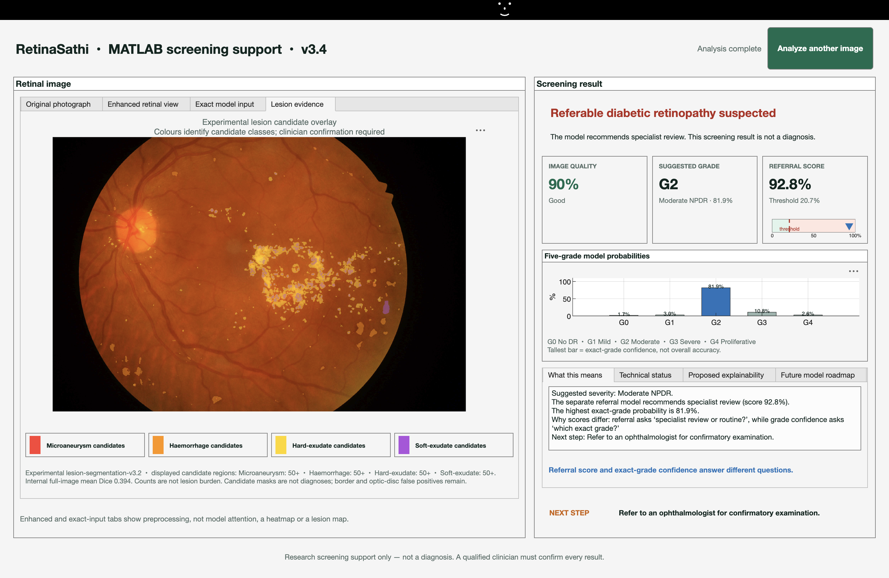
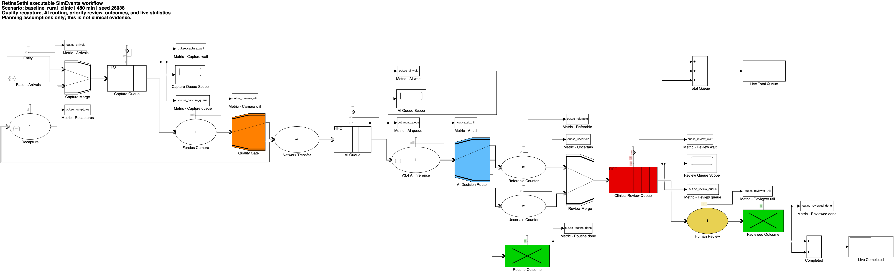
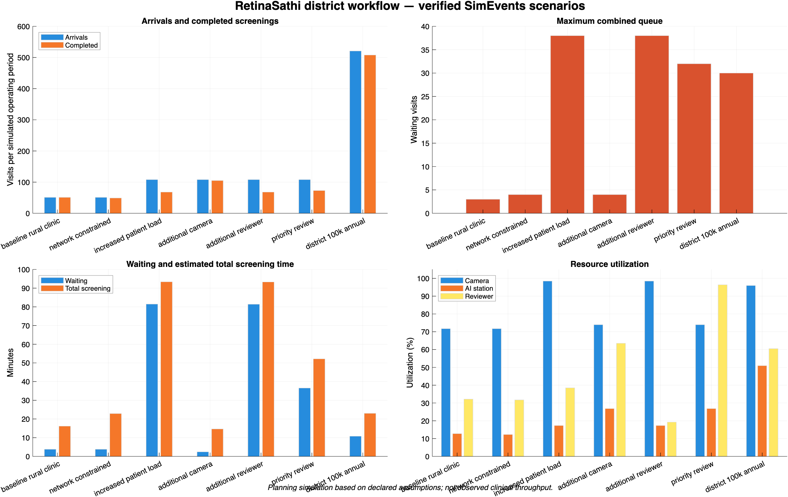

# Use the RetinaSathi MATLAB app and Simulink workflow

This guide is for someone opening the project on their own computer. It covers the **MATLAB screening window**, the frozen V3.4 model, the optional experimental V3.2 lesion overlay, and the **Simulink/SimEvents clinic simulation**. You do not need to train a model to use either prototype.

> RetinaSathi is research screening support. Its result is not a diagnosis. A qualified clinician must confirm every finding and referral decision.

## What you need

| Item | Why it is needed |
|---|---|
| MATLAB **R2026a** | Version used for the verified prototype. Other versions may need ONNX import or UI adjustments. |
| Image Processing Toolbox and Deep Learning Toolbox | Retinal preprocessing and ONNX model inference. |
| Simulink and SimEvents | Executable clinic workflow and queue simulation. |
| This repository | MATLAB app source, Simulink model, model manifests, and scripts. |
| V3.4 ONNX file | Required for real-image DR referral and Grade 0–4 predictions. It is supplied privately, not stored on GitHub. |
| V3.2 lesion ONNX file | Optional, only for the experimental four-class overlay. |
| A permitted, de-identified fundus image | JPEG, PNG, or TIFF for a local demonstration. Do not use patient images without the required permissions. |

The MATLAB app is separate from the web app. InsForge sign-in and internet access are **not required** to run the local MATLAB window after MATLAB and the model files are available.

## 1. Get the files into place

Clone or download the repository, then keep its folder structure. In the commands below, replace `/path/to/X-Retina` with the actual folder on your computer.

```text
X-Retina/
├── matlab/
│   └── launchV34LesionPrototype.m
├── models/
│   ├── retinasathi-v3-4.manifest.json
│   ├── retinasathi-v3-4.onnx            ← obtain privately
│   ├── retinasathi-lesions-v3-2.manifest.json
│   └── retinasathi-lesions-v3-2.onnx    ← optional; obtain privately
└── simulink/
    └── RetinaSathiScreeningWorkflow.slx
```

The `.onnx` binaries are intentionally excluded from Git because they are large model weights. Get the **exact hash-matching** files from the project team; do not substitute a different ONNX file under the same name. The MATLAB classifier checks its manifest and rejects a mismatched model. If you only have the V3.4 classifier, use the basic app command below; the lesion tab will report that its model is unavailable.

## 2. Check MATLAB and open the screening window

Open MATLAB. Paste these commands in the **Command Window**:

```matlab
cd('/path/to/X-Retina/matlab')
setup
check_toolboxes
```

Confirm that MATLAB, Image Processing Toolbox, and Deep Learning Toolbox are installed and licensed. For the optional simulation, also confirm Simulink and SimEvents.

### Standard V3.4 window

```matlab
cfg = struct( ...
    "modelGeneration", "v3.4", ...
    "modelPath", "../models/retinasathi-v3-4.onnx", ...
    "manifestPath", "../models/retinasathi-v3-4.manifest.json");
launchRetinaSathiApp(cfg)
```

The **RetinaSathi · MATLAB screening support · v3.4** window opens. Click **Choose retinal image**, select a permitted fundus photograph, and wait for **Analysis complete**. To test another image, click **Analyze another image**.

To open with a known image immediately, add its absolute path before calling the app:

```matlab
cfg.initialImagePath = "/path/to/your/deidentified-fundus.jpg";
launchRetinaSathiApp(cfg)
```

### Window with the experimental lesion overlay

Place the V3.2 lesion ONNX file and its manifest in `models/`, then use:

```matlab
launchV34LesionPrototype
```

To load a permitted image at launch:

```matlab
launchV34LesionPrototype("/path/to/your/deidentified-fundus.jpg")
```

This launcher checks that **both** the classifier and lesion artifacts are present. The overlay is optional research evidence, not part of the V3.4 referral decision.



## 3. Read the MATLAB result correctly

| Window area | What it means |
|---|---|
| **Original photograph** | The image you selected. |
| **Enhanced retinal view** | A display-friendly preprocessing view. |
| **Exact model input** | The processed image sent to V3.4; it is **not** an attention or lesion map. |
| **Lesion evidence** | Optional V3.2 candidate masks for microaneurysms, haemorrhages, hard exudates, and soft exudates. Colours mark candidates, not confirmed pathology. |
| **Image quality** | Whether the photo is usable. If it is poor, the app asks for a retake and withholds the DR decision. |
| **Suggested grade** | Estimated DR severity from G0 to G4. |
| **Referral score** | Output of the separate referral model compared with its saved threshold. This is different from exact-grade confidence. |
| **Five-grade probabilities** | The model's distribution over G0–G4. The tallest bar is not overall accuracy. |
| **What this means / Next step** | Plain-language screening route for a trained operator. |
| **Technical status** | Shows which modules were run and which remain unavailable or experimental. |

The screenshot above shows one example result. Its numerical scores belong to that image only; they are **not** the project's evaluation accuracy. The lesion candidate can contain false positives at the retinal border and optic disc. The measured V3.2 internal full-image mean Dice was **0.3937 on 11 images**; this is not clinical validation. V3.4 does not assess DME, and its unvalidated attention map stays disabled.

## 4. Verify the MATLAB implementation

The MATLAB contract tests can run without a retinal image:

```matlab
cd('/path/to/X-Retina/matlab')
setup
results = runtests('tests/testV34Contract.m');
assert(all([results.Passed]))
```

For the full **Python/ONNX/MATLAB parity** check, the team must also provide the local 25-case fixture folder at `runs/v3_4_matlab_parity/`. From a terminal in the repository root:

```bash
./scripts/verify_v3_4_matlab.sh
```

That command checks the manifest, runs MATLAB tests, and compares grade and referral decisions against the saved engineering fixtures. The recorded 25/25 agreement proves software consistency on that fixed set; it does not prove clinical accuracy on new patients.

## 5. Open the Simulink clinic workflow

Simulink uses **synthetic screening visits**. It is an operations model of arrivals, camera capture, image-quality retakes, network transfer, AI queueing, referral routing, and clinician review. It does **not** call the V3.4 ONNX model for every simulated visit.

In a new MATLAB Command Window session:

```matlab
cd('/path/to/X-Retina/simulink')
p = parameters();
model = build_retinasathi_workflow(p);
open_system(model)
set_param(model, 'SimulationCommand', 'start')
```

The blocks in the diagram show the visit path. **Queue scopes** show how many visits are waiting; **Live Total Queue** and **Live Completed** show backlog and completed visits as simulated time advances.



For a paced demonstration that opens the scopes:

```matlab
model = launch_simevents_demo(20);
set_param(model, 'SimulationCommand', 'start')
```

## 6. Run scenarios and inspect the results

To run one scenario and export its metrics:

```matlab
metrics = run_simevents_workflow(parameters(), "results/simevents");
disp(metrics)
```

To run all seven scenarios:

```matlab
results = run_simevents_scenarios("results/simevents");
disp(struct2table(results))
```

The results are written as CSV and JSON under `simulink/results/simevents/`, including `scenarios_simevents.csv`. You can also run the software checks:

```matlab
report = verify_simevents_workflow(true, "results/simevents");
disp(report)
```

The seven scenarios include baseline, constrained network, increased load, extra camera, extra reviewer, priority review, and district scale. In the recorded run, adding a camera under increased load raised simulated completions from **68 to 105**. The district configuration produced **508 visits in ten simulated hours**, equivalent to **127,000 visits over 250 identical days**. These are outputs of the stated planning assumptions, not observed hospital throughput.



## Common problems

| What you see | What to check |
|---|---|
| `Unrecognized function` | Run `setup` from the `matlab/` folder. For Simulink, first change to the `simulink/` folder. |
| Missing V3.4 or lesion artifact | Check the exact ONNX and manifest filenames in `models/`. The standard app needs only V3.4; the lesion launcher needs both. |
| Model hash or import error | Confirm the ONNX file came from the approved handoff and matches its manifest. Check Deep Learning Toolbox and MATLAB version. |
| Poor image / retake | Choose a clear, properly framed fundus image. No DR result is expected for an ungradeable photo. |
| Lesion tab says unavailable | The optional V3.2 artifact is absent or failed its validation. The DR referral path can still run without it. |
| SimEvents library block missing | Check that SimEvents is installed and licensed with `check_toolboxes`. |
| Slow first prediction | MATLAB may need to import the ONNX graph on first use; later predictions can be faster. |

For deeper implementation detail, read the [MATLAB README](../matlab/README.md), [Simulink README](../simulink/README.md), [parity report](V3_4_MATLAB_PARITY_REPORT.md), and [lesion implementation report](LESION_SEGMENTATION_V3_IMPLEMENTATION.md).
